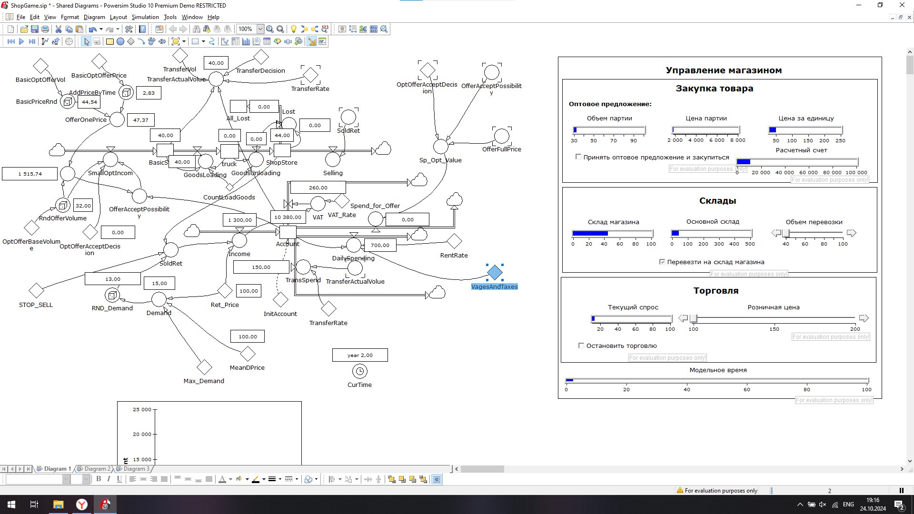

# ModSysLab3

## Постановка задачи
Что предлагается сделать. Внесите изменения в модель так, чтобы появился хотя бы еще один уровень, связанный с другими элементами модели. Далее протестируйте обновленную модель, внесите изменения, если будет необходимо. Полученную модель преобразуйте в код алгоритмического языка по предложенной методике. Полученный код измените так, чтобы программа предлагала вводить данные перед каждым шагом моделирования, предварительно выводя основные параметры объекта моделирования.
  
### Варианты изменения модели:
- возможность кредитования магазина;  
- учет перевозки товара через уровень (в машину погрузили, затем выгрузили - промежуточный между складами уровень);  
- возможность поэтапной оплаты за мелкооптовые партии;  
- налоговый учет (выплаты налогов каждые 30 дней, между выплатами - накопительные оценки, расчет налоговой базы и самого налогового платежа);  
- зависимость спроса не только от цены, но и квалификации и мотивации продавцов)....  
  
### Выводимые параметры объекта моделирования могут включать:
- состояние расчетного счета;
- мелко-оптовое предложение: объем партии, цена за единицу;
- состояния складов (базового, в магазине);
- расходы и др.

### Вводимые параметры могут включать:
- объем перевозки товара между базовым складом и магазином (0 - значит нет трансфера);
- решение о закупке мелкооптовой партии в соответствии с предложением;
- цена продажи.
- Базовые параметры модели, такие как, базовая цена для расчета спроса, базовая цена для расчета стоимости предложения (мелкооптовая партия), начальное значение расчетного счета могу, задаваться либо в форме констант, либо в текстовом файле, который может подгружаться перед инициализацией модели. 

## Обобщёний алгоритм программы
Я решил реализовать учет перевозки товара через уровень (добавить погрузку выгрузку из авто).

### Инициализация констант 
Данные об объёмах перевозки одним авто храним в константе CountLoadGoods, так же дела обстоят и с розничной ценой на товар в магазине, платой за аренду, налогами, базой для предложения по оптовой закупке и спросу и стартовому балансу магазина.

### Инициализация
Инициализация происходит только с одной константой - это изначальный баланс магазина кроссовок

### Расчет уровней
Всего уровней в программе 5:
- **Объём денег на счету магазина**:  
Рассчитывается из приходящей прибыли, трат на закупки (партия + трансфер), налоги, аренду
- **Объём продукции на складе поставщика:**  
Рассчитывается на основе объёма партии, принято ли решение закупать партию и достаточно ли средств на её закупку
- **Объём продукции в грузовике:**  
Рассчитывается исходя из остатков на складе поставщика и вмещаемого объёма
- **Объём продукции в магазине**:  
Рассчитывается исходя из прибывающих поставок, текущего спроса на товар и загруженности самого склада 
- **Объём потерянной продукции**:  
Рассчитывается исходя из прибывающих поставок и загруженности самого склада магазина

### Расчет темпов
Всего темпов в программе 9:
- **Темп отгрузки на склад поставщика**:  
Рассчитывается из приходящей прибыли, трат на закупки (партия + трансфер), налоги, аренду
- **Темп погрузки в грузовик**: 
Рассчитывается из грузоподъёмности и наличие товара на складе
- **Темп отгрузки на склад магазина**: 
Рассчитывается из наличия товара внутри грузовика и грузоподъёмности
- **Темп потери продукции**: 
Рассчитывается из загруженности склада и отгрузки на склад
- **Темп продажи продукции**: 
Рассчитывается из грузоподъёмности и наличие товара на складе
- **Темп получения прибыли**: 
Рассчитывается из текущего спроса и цены розницы
- **Темп трат на закупку партии**: 
Рассчитывается из цены на партию, наличия достаточной суммы на счету и запроса на закупку
- **Темп трат на оплату транспортировки партии**: 
Рассчитывается из цены на перевозку и наличия неперевезённой партии 
- **Темп трат на оплату дневных расходов**: 
Рассчитывается из арендной платы и налогов
- **Темп трат на оплату НДС**: 
Рассчитывается из размера НДС
### Вывод пошаговых данных



### Ввод пошаговых данных


### Код программы 
```
import random
import math
from itertools import count
from json import loads

Account = 10000
BasicStore = 80
ShopStore = 0
Time = 0 # текущий день
TimeCount = 10 # количество дней
TransferRate = 150
OptOfferBaseVolume = 40
Max_Demand = 30
MeanDPrice = 100
RentRate = 200
WagesAndTaxes = 500
BasicOptOfferVol = 50
BasicOptOfferPrice = 35
CountLoadsGoods = 40
Truck = 0

while Time <= TimeCount:
    Time += 1

    print(f"--- День {Time} ---")
    print(f"Расчетный счет: {Account}")
    print(f"BasicStore: {BasicStore}")
    print(f"ShopStore: {ShopStore}")

    # Мелкооптовое предложение
    BasicPriceRnd = BasicOptOfferVol * random.uniform(0.7, 1.3)
    AddPriceByTime = (
        BasicOptOfferPrice * 0.03 * Time
        + BasicOptOfferPrice * 0.01 * Time * random.uniform(0, 1)
    )
    OfferOnePrice = AddPriceByTime + BasicPriceRnd
    RndOfferVolume = round(OptOfferBaseVolume * random.uniform(0.75, 1.25))
    print(
        f"Мелкооптовое предложение: \n Объем партии {RndOfferVolume} \n Цена за единицу {OfferOnePrice:.2f}"
    )

    # Расходы
    total_expenses = RentRate + WagesAndTaxes
    print(f"Расходы (аренда и зарплаты): {total_expenses}")

    # Предлагаем пользователю ввести свои данные
    try:
        TransferVol = float(input("Введите объем переноса товара (TransferVol): "))
        TransferDecision_input = input(
            "Принять решение о переносе товара? (TransferDecision) (1 - Да, 0 - Нет): "
        )
        TransferDecision = bool(int(TransferDecision_input))
        OptOfferAcceptDecision_input = input(
            "Принять мелкооптовое предложение? (OptOfferAcceptDecision) (1 - Да, 0 - Нет): "
        )
        OptOfferAcceptDecision = bool(int(OptOfferAcceptDecision_input))
        Ret_Price = float(input("Введите розничную цену (Ret_Price): "))
        STOP_SELL_input = input("Остановить продажи? (STOP_SELL) (1 - Да, 0 - Нет): ")
        STOP_SELL = bool(int(STOP_SELL_input))
    except ValueError:
        print("Неверный ввод. Пожалуйста, введите числовые значения.")
        continue

    # Расчеты
    BasicPriceRnd = BasicOptOfferVol * random.uniform(0.7, 1.3)
    AddPriceByTime = (
        BasicOptOfferPrice * 0.03 * Time
        + BasicOptOfferPrice * 0.01 * Time * random.uniform(0, 1)
    )
    OfferOnePrice = AddPriceByTime + BasicPriceRnd

    # TransferActualVol
    if Account >= TransferRate:
        TransferActualVol = min(BasicStore, TransferVol * TransferDecision)
    else:
        TransferActualVol = 0

    # RndOfferVolume
    RndOfferVolume = round(OptOfferBaseVolume * random.uniform(0.75, 1.25))

    # OfferFullPrice
    OfferFullPrice = OfferOnePrice * RndOfferVolume

    # OfferAcceptPossibility
    if Account >= OfferFullPrice:
        OfferAcceptPossibility = 1
    else:
        OfferAcceptPossibility = 0

    # SmallOptIncom
    SmallOptIncom = OfferAcceptPossibility * OptOfferAcceptDecision * RndOfferVolume

    # Demand
    Demand = round(
        Max_Demand
        * (1 - 1 / (1 + math.exp(-0.05 * (Ret_Price - MeanDPrice))))
    )

    # RND_Demand
    RND_Demand = round(Demand * random.uniform(0.7, 1.2))

    # SoldRet
    if STOP_SELL:
        SoldRet = 0
    else:
        SoldRet = min(RND_Demand, ShopStore)

    if Truck > 0:
        GoodsLoading = 0
        GoodsUnloading = CountLoadsGoods
    else:
        GoodsLoading = CountLoadsGoods
        GoodsUnloading = 0

    Truck += GoodsLoading
    Truck -= GoodsUnloading

    # GoodsTransfer
    GoodsTransfer = math.trunc(TransferActualVol)

    # Обновление BasicStore
    BasicStore += SmallOptIncom
    BasicStore -= GoodsLoading

    # Обновление ShopStore
    ShopStore += GoodsUnloading
    ShopStore -= SoldRet

    # Selling
    Selling = SoldRet

    # Sp_Opt_Value
    if OfferAcceptPossibility * OptOfferAcceptDecision > 0:
        Sp_Opt_Value = OfferFullPrice
    else:
        Sp_Opt_Value = 0

    # Income
    Income = Ret_Price * SoldRet

    # Обновление Account
    Account += Income

    # TransSpend
    if TransferActualVol > 0:
        TransSpend = TransferRate
    else:
        TransSpend = 0

    # DailySpending
    DailySpending = min(RentRate + WagesAndTaxes + Ad_Spend, Account)
    Spend_for_Offer = Sp_Opt_Value

    # Обновление Account
    Account -= TransSpend + DailySpending + Spend_for_Offer

    # Вывод результатов
    print(f"Общие расходы за день: {total_expenses}")
    print(f"Доход от продаж: {Income}")

    # Проверка баланса счета
    if Account <= 0:
        print("Баланс исчерпан. Вы банкрот.")
        break

```